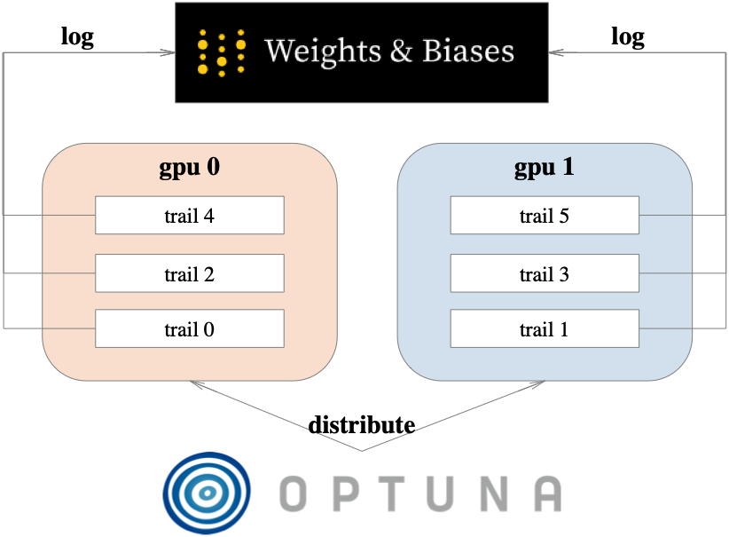
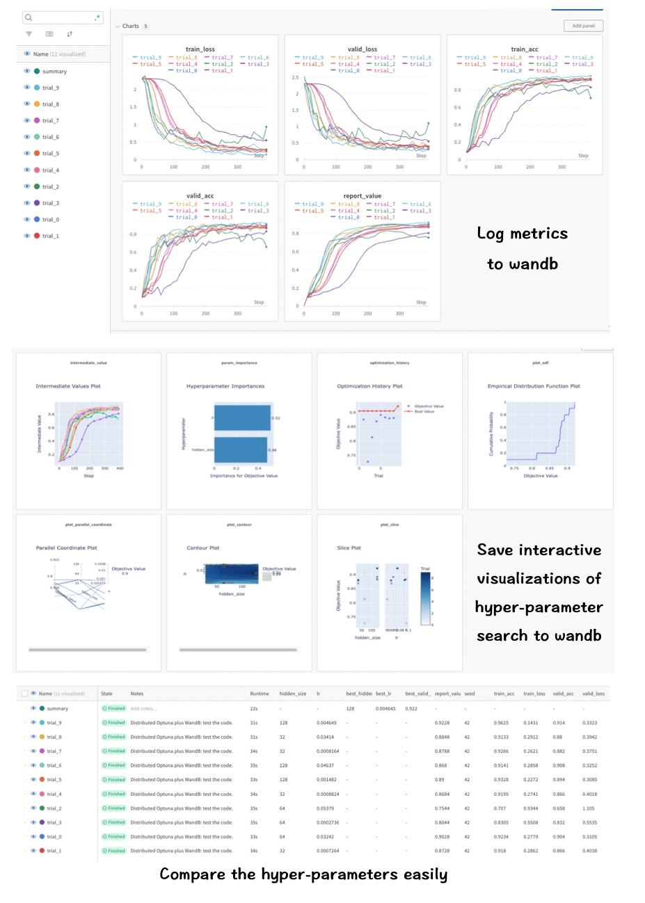

# Distributed Optuna plus WandB

This repo provides a way to incorporate [Optuna](https://optuna.org/) and [WandB](https://wandb.ai/site). 



You may need this repo if you want to:

1. log and track your experiment using [WandB](https://wandb.ai/site).
2. enjoy automate hyperparameter search using [Optuna](https://optuna.org/).
3. have multiple runs for hyperparameter searching at the same time.

You will get this:



## Structure Overview

distributed_optuna_plus_wandb works as a hook inserted to the Trainer.

### Trainer Design

The following code shows the structure of ` run()` . 

``` python
def run(self):
        self.before_train()
        for epoch in range(self.max_epoch):
            self.current_epoch = epoch
            self._iter_train_loader = iter(self.train_loader)
            for batch in range(self.len_loader):
                self.current_iter = batch + self.current_epoch * self.len_loader
                
                self.before_iter()

                # train one iter
                self.model.train()
                batch = next(self._iter_train_loader)
                self.send_batch_to_device(batch)
                self.train_one_iter(batch)
                self.model.eval()
                
                # valid if needed
                if self.current_iter % self.valid_freq == 0:
                    with torch.no_grad():
                        self.valid()
                self.after_iter() 

        self.after_train()
```

### Tuner Design

distributed_optuner_plus_wandb mainly relies on ` OptunawandbHook`  and ` OptunawandbBase` .

` OptunawandbBase` is a controller to run the trainer.

` OptunawandbHook` takes over logging, pruning, value reporting stuffs for each trials.

## Usage

You can run an example here to see how to tune params while training a CNN on MINIST using the distributed_optuner_plus_wandb.

### Step 1: Use the Trainer

Run ` train.py` to solely enjoy the trainer. see explame here.

``` python
class Trainer(BaseTrainer):
    def __init__(self,model,opt,train_loader,valid_loader,test_loader,device,max_epoch,valid_freq=1):
       super(Trainer,self).__init__(model,opt,train_loader,valid_loader,test_loader,device,max_epoch,valid_freq)
    
    def train_one_iter(self,batch):
        x,y = batch
        logits = self.model(x)
        loss = F.cross_entropy(logits,y)
        
        self.opt.zero_grad()
        loss.backward()
        self.opt.step()
        
        self.train_out = {
            "loss":loss,
        }
     def valid(self,):
      	...
        self.valid_out{
          "loss":loss,
        }

trainer = Trainer(model=model,opt=opt,train_loader=train_loader,valid_loader=valid_loader,
        test_loader=test_loader,device=torch.device("cuda:0" if torch.cuda.is_available() else "cpu"),
        max_epoch=5,valid_freq=10,)
trainer.run()
```

The defualt logger is taken over by the LogHook. The metrics you save at ` self.train_out`  and ` self.valid_out` will be automatically plotted and saved. After running the experiment, you will get a log dir like this:

``` 

output
  └── 2023_07_13_10_23
      ├── Plots of training summary metrics.pdf
      ├── Plots of training summary metrics.png
      ├── Plots of validation summary metrics.pdf
      ├── Plots of validation summary metrics.png
      └── log.txt

```

### Step 2: Use the Tuner

1. create a class that inherits from OptunawandbBase, and implement the methods: ` load_items` , ` get_suggested_params` , and ` get_other_cfg`  .

2. call ` run()`  to start searching for the best params.

``` python
class ParamTune(OptunawandbBase):
  def load_items(self,**kwargs):
    """return the trainer"""
    # load cfg defined in get_suggested_params() and get_other_cfg()
    opt = optim.Adam(model.parameters(), lr=kwargs["lr"]) 
    # init a trainer in step 1
    trainer = Trainer(
      ...
      )
   	return trainer
  
  def get_suggested_params(self, trial):
    """define the params that you want to tune"""
    trial_params = dict(
    		lr = trial.suggest_loguniform('lr', 1e-4,1e-1),
      	hidden_nodes = trial.suggest_categorical('hidden_nodes', [32,64,128])
    )
    return trial_params
  
  def get_other_cfg(self):
    """define other params that you don't want to tune"""
    return dict(
      input_size = 28,
      num_layers = 2,
    )

paramtuner = ParamTune(
	proj_name = 'myproj',
  	exp_purpose = 'Distributed Optuna plus WandB: test the code.',
  	do_init_wandb = True, # whether to init wandb, set to False if you want to run the code locally
  	metric = 'valid_acc', # metric to be optimized, should be included in self.valid_out in the method Trainer.valid()
  	n_search_trials = 10, # number of trials to find the best hyperparams
  	report_last_n=5, 
  	do_fixed_trial=False,
  	n_fixed_trials=1,
  	trial_name=None,
  	storage='sqlite:///optuna.db',
  	n_jobs=4, # number of parallel jobs
  	n_gpus=2, # number of gpus
  	client=None,
  	allow_prune=True, # whether prune the trial
)

# register the given fixed trial(s) using self.study.enqueue_trial(trial_param)
# Enqueue a trial with given parameter values.
# fix the sampling parameters at the beginning of searching
trial_param_list = [
  dict(lr = 1e-2,hidden_size = 256,**paramtuner.get_other_cfg()),
  dict(lr = 1e-2,hidden_size = 64,**paramtuner.get_other_cfg()),
]

# start searching...
paramtuner.run(
        trial_param_list=trial_param_list,
    )
```

## Features

#### trial_param_list: the start point to search

You can fix the sampling parameters at the beginning of searching.

distributed_optuna_plus_wandb will call ` study.enqueue_trial` . See doc at [link](https://optuna.readthedocs.io/en/stable/reference/generated/optuna.study.Study.html#optuna.study.Study.enqueue_trial).

Define your ` trial_param_list` and pass it to the ` ParamTune` object, then `trial_param_list` could be the start point to search.

``` python
# register the given fixed trial(s) using self.study.enqueue_trial(trial_param)
# Enqueue a trial with given parameter values.
# fix the sampling parameters at the beginning of searching

trial_param_list = [
  dict(lr = 1e-2,hidden_size = 256,**paramtuner.get_other_cfg()), # the first set of params to run
  dict(lr = 1e-2,hidden_size = 64,**paramtuner.get_other_cfg()), # the second set of params to run
]

# start searching...
paramtuner.run(
        trial_param_list=trial_param_list,
    )
```

#### Fixed trails: run N times of your given setting

- ` do_fixed_trial` : set to True to run fixed number of trials (` n_fixed_trials` ) with fixed params,  the fixed params should be specified in ` trial_param_list` . pass ` trial_param_list`  to run() to specify the params.
- ` n_fixed_trials`: number of fixed trials to run.

In the following example, the first set of params will be run for 5 times and then the second set of params will be run 5 times, i.e., 10 trials in total.

For each trail/run, the seed will be automatically set to 42 + trail_number if the same set of params has been used. 

``` python
paramtuner = ParamTune(
		... 
  	do_fixed_trial=True,
  	n_fixed_trials=5,
  	...
)

trial_param_list = [
  dict(lr = 1e-2,hidden_size = 256,**paramtuner.get_other_cfg()), # the first set of params to run
  dict(lr = 1e-2,hidden_size = 64,**paramtuner.get_other_cfg()), # the second set of params to run
]

# start searching...
paramtuner.run(
        trial_param_list=trial_param_list,
    )
```

#### Define which metric to be optimized

1. return the metrics that you want to optimized in trainer in `valid()` method. 

   ``` python
   class Trainer(BaseTrainer):
       ...
        def valid(self,):
        		metric_to_report = ...
         	...
           self.valid_out{
             "loss":loss,
             "metric_to_report": metric_to_report,
           }
   ```

2. show the tuner which metric to be optimized.

   ``` python
   paramtuner = ParamTune(
     ...
     metric = 'valid_metric_to_report', # must add 'valid_'
     report_last_n=5, # report the mean of last five valid_metric_to_report in the history
     ...
   )
   ```

#### Prune the trial

By default, pruning is allowed. And is forced to be not allowed in fixed trails mode (` do_fixed_trial=True`  and ` n_fixed_trials>1` ). Set ` allow_prune = False`  to disable pruning. 

The pruning is based on reported value, which is the `metric` you set in the previous subsection.

## Dependency

``` 
torch                     1.11.0
optuna-distributed        0.4.0
optuna                    3.1.1
wandb                     0.15.0
python                    3.8.12
```

## Acknowledgments

- [PyTorch](https://pytorch.org/), [Optuna](https://optuna.org/), and [WandB](https://wandb.ai/site), serve as the foundation upon this template.

- [Core PyTorch Utils (CPU)](https://github.com/serend1p1ty/core-pytorch-utils) is mainly referred when developing the trainer. Only simple functions of the trainer were implemented in this repo.

- [optima-distributed](https://github.com/xadrianzetx/optuna-distributed) is used to allow distributed optimization of Optuna. Also see its post at [medium](https://medium.com/optuna/running-distributed-hyperparameter-optimization-with-optuna-distributed-17bb2f7d422d).


